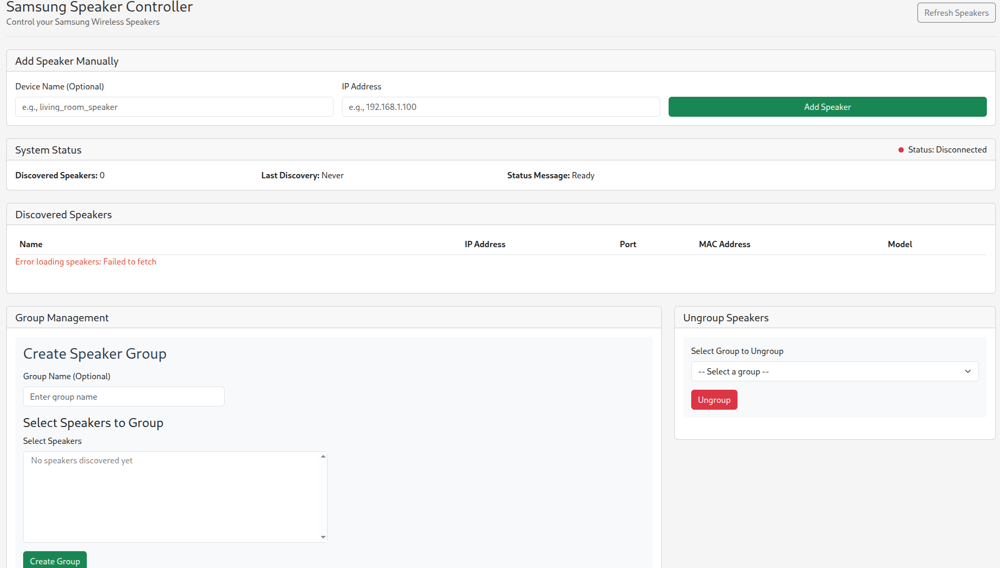

# Samsung Speaker Controller

A Spring Boot application for controlling Samsung speakers, featuring a REST API and a web-based user interface.

## Table of Contents
- [Features](#features)
- [Prerequisites](#prerequisites)
- [Installation](#installation)
- [Usage](#usage)
- [API Endpoints](#api-endpoints)
- [Web UI](#web-ui)
- [Scripts](#scripts)
- [Configuration](#configuration)
- [License](#license)

## Features

- **Speaker Grouping**: Group multiple Samsung speakers together for synchronized playback
- **Speaker Ungrouping**: Remove speakers from groups or ungroup all speakers at once
- **REST API**: Programmatic control via HTTP endpoints
- **Web Interface**: Modern user-friendly web UI with tabular speaker display and intuitive controls
- **mDNS Discovery**: Automatic discovery of Samsung speakers on the network with 30-second discovery interval
- **Manual Addition**: Option to manually add speakers by IP address
- **Enhanced UI**: Table-based speaker listing, dropdown selection for grouping, and improved layout

## Prerequisites

- Java 11 or higher
- Maven 3.6.0 or higher

## Installation

1. Clone the repository:
   ```bash
   git clone https://github.com/Lunatic16/samwamgrp.git
   cd SamsungSpeakerController
   ```

2. Build the project:
   ```bash
   mvn clean package -DskipTests
   ```

## Usage

### Running the Application

#### Method 1: Using Maven
```bash
mvn spring-boot:run
```

#### Method 2: Using JAR file
```bash
java -jar target/controller-0.0.1-SNAPSHOT.jar
```

#### Method 3: Using Scripts (recommended)
```bash
# Start the application
./start.sh

# Stop the application
./stop.sh
```

The application will be accessible at `http://localhost:8888`

### Web UI Access

After starting the application, navigate to:
- `http://localhost:8888` in your web browser

The web UI provides:
- System status monitoring
- Speaker discovery and listing (now displayed in a table view with Name, IP, Port, MAC, and Model columns)
- Group creation functionality with dropdown selection for speakers
- Group management (ungrouping) now positioned on the right side of the interface
- Manual speaker addition by IP address
- Response logging

## API Endpoints

### Group Speakers
- **POST** `/group`
- Create a group of speakers
- Request body (JSON):
  ```json
  {
    "speakerName": ["speaker1", "speaker2", "speaker3"]
  }
  ```
- Optional query parameter: `group_name`
- Response: JSON with status and group name

### Ungroup Speakers
- **GET** `/ungroup`
- Ungroup speakers
- Optional query parameter: `group_name` (to ungroup specific group, or omit to ungroup all)
- Response: JSON with operation status

## Scripts

### Controller Script
The `controller.sh` script provides start, stop, restart, and status functions:
- `./controller.sh start` - Builds the project if necessary and starts the application in the background
- `./controller.sh stop` - Stops the running application
- `./controller.sh restart` - Restarts the application
- `./controller.sh status` - Shows the status of the application
- `./controller.sh help` - Shows usage information

The script:
- Stores the process PID in `controller.pid`
- Logs output to `controller.log`
- Prevents multiple instances from running
- Automatically finds and manages the application process

## Configuration

### Application Properties
The application uses `config/application.properties` which is copied to the classpath during build:
- Default server port: 8888

### Customization
To change the server port or other settings, modify `config/application.properties`:
```properties
server.port = 8888
```

### Discovery Settings
The application automatically scans for Samsung speakers for 30 seconds during startup. This duration is hardcoded in the `SpeakerController.java` file and can be modified by changing the `Thread.sleep(30000)` value (milliseconds).


## Development

### Project Structure
```
SamsungSpeakerController/
├── config/                    # Configuration files
│   └── application.properties
├── src/
│   ├── main/
│   │   ├── java/
│   │   │   └── com/kajahla/speakers/samsung/controller/
│   │   │       ├── ControllerApplication.java     # Main Spring Boot application
│   │   │       ├── WebUIController.java           # Web UI endpoints
│   │   │       ├── SpeakerController.java         # API endpoints
│   │   │       └── model/
│   │   │           ├── GroupInfo.java
│   │   │           ├── SpeakerInfo.java
│   │   │           └── SpeakerList.java
│   │   └── resources/
│   │       └── static/                            # Web UI files
│   │           ├── index.html
│   │           ├── style.css
│   │           └── script.js
│   └── test/
├── controller.sh                # Controller script (start/stop/status)
├── pom.xml                      # Maven configuration
└── README.md
```

### UI Enhancements

The WebUI has been redesigned to match the WAM-Nodejs application style with the following improvements:

1. **Table View**: Speakers are now displayed in a clean table format with Name, IP, Port, MAC, and Model columns
2. **Dropdown Selection**: Speaker selection for grouping is now done using a multi-select dropdown menu
3. **Layout Improvements**: Ungroup section is positioned on the right side of the interface
4. **Automatic Discovery**: Increased discovery time to 30 seconds for more thorough speaker scanning

### Building from Source
```bash
# Clean and build
mvn clean package

# Build without running tests
mvn clean package -DskipTests

# Compile only
mvn compile
```

## Troubleshooting

### Common Issues
1. **Port already in use**: Make sure port 8888 is not being used by another application
2. **Speaker Discovery**: Ensure Samsung speakers are on the same network and mDNS is enabled
3. **Access from other machines**: The default configuration only binds to localhost

### Logs
Check `controller.log` when using the start script, or view console output when running directly.

## Contributing

1. Fork the repository
2. Create a feature branch (`git checkout -b feature/amazing-feature`)
3. Commit your changes (`git commit -m 'Add some amazing feature'`)
4. Push to the branch (`git push origin feature/amazing-feature`)
5. Open a Pull Request

## License

This project is licensed under the MIT License - see the [LICENSE](LICENSE) file for details.

## Acknowledgments

- Uses Spring Boot for the web framework
- Uses JmDNS for service discovery
- Inspired by the need for better multiroom audio control

## Screenshot

Here's a screenshot of the Samsung Speaker Controller Web UI:



